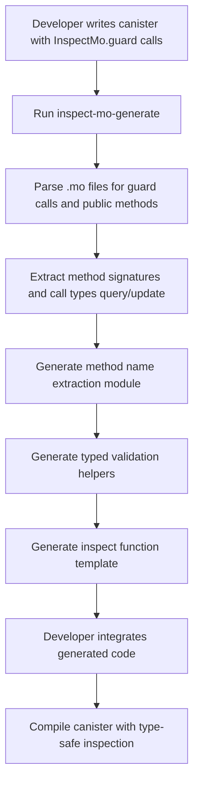

# Inspect-Mo: Technical Architecture

## ErasedValidator Pattern - Core Innovation

The InspectMo library solves a fundamental type erasure challenge using an innovative **function generator** pattern.

### The Type Erasure Problem

```motoko
// ❌ This won't work - each method has different M types
private var methodRules = BTree.empty<Text, MethodGuardInfo<M, T>>();

// Method1: update_profile(Text, Text) 
// Method2: transfer(Principal, Nat)
// Method3: upload_file(Blob)
// Can't store different M types in same BTree!
```

### The ErasedValidator Solution

```motoko
// ✅ Function Generator Pattern
public type ErasedValidator<T> = (InspectArgs<T>) -> Result<(), Text>;

public func createMethodGuardInfo<M>(
  methodName: Text, 
  isQuery: Bool,
  rules: [ValidationRule<T,M>], 
  msgAccessor: (T) -> M
) : MethodGuardInfo<T> {
  {
    methodName = methodName;
    isQuery = isQuery;
    validator = func(msg: InspectArgs<T>) : Result<(), Text> {
      // "Bake" the validation logic with full type information
      let typedArgs: M = msgAccessor(msg.msg);
      
      // Apply each rule with typed context
      for (rule in rules.vals()) {
        switch (validateSingleRule<M>(rule, msg, typedArgs)) {
          case (#ok) { /* continue */ };
          case (#err(errMsg)) { return #err(errMsg) };
        }
      };
      #ok
    };
  }
}
```

### Benefits

- **Type Safety**: Full compile-time type checking during registration
- **Performance**: No runtime type resolution - validation logic "baked in"
- **Storage Efficiency**: Single BTree stores all methods regardless of types  
- **Flexibility**: Each method can have completely different parameter types


## Module Structure

```
src/
├── lib.mo                 # Main public inspector Class 
├── core/
│   ├── types.mo          # Core type definitions
│   ├── inspector.mo      # Main inspection logic
│   ├── rules.mo          # Rule definition and validation
│   ├── patterns.mo       # Method pattern matching
│   └── size_validator.mo # Size validation for Nat/Text/Blob
├── security/
│   ├── rate_limiter.mo   # Rate limiting implementation
│   ├── auth.mo           # Authentication helpers
│   ├── permissions.mo    # Permission module integration
│   └── common_rules.mo   # Pre-built security rules
├── integrations/
│   ├── permission_systems/ # Simplified permission system integrations
│   │   ├── rbac_adapter.mo    # RBAC integration adapter
│   │   ├── ii_integration.mo  # Simplified Internet Identity (principal type detection)
│   │   └── custom_auth.mo     # Custom authentication provider interface
└── utils/
    ├── parser.mo         # Argument parsing utilities
    ├── size_analyzer.mo  # Type-aware size calculation
    └── logger.mo         # Audit logging
```

## Core Types

```motoko
// Core configuration types
public type InspectConfig = {
  allowAnonymous: ?Bool;         // Global default for anonymous access
  defaultMaxArgSize: ?Nat;       // Global default argument size limit
  authProvider: ?AuthProvider;   // Permission system integration
  rateLimit: ?RateLimitConfig;   // Global rate limiting
  
  // Query vs Update specific defaults
  inspectDefaults: ?InspectConfig;   // Defaults for inspect checks
  guardDefaults: ?GuardConfig; // Defaults for guard checks
  
  developmentMode: Bool;         // Enable relaxed rules for testing
  auditLog: Bool;               // Enable audit logging
};

public type InspectConfig = {
  allowAnonymous: ?Bool;
  maxArgSize: ?Nat;
  rateLimit: ?RateLimitConfig;
};

public type GuardConfig = {
  allowAnonymous: ?Bool;
  maxArgSize: ?Nat;
  rateLimit: ?RateLimitConfig;
};

public type ValidationRule = {
  // MVP Core Rules for boundary validation with typed accessor functions
  #textSize: <T>(accessor: T -> Text, min: ?Nat, max: ?Nat);     // Text size validation with typed accessor
  #blobSize: <T>(accessor: T -> Blob, min: ?Nat, max: ?Nat);     // Blob size validation with typed accessor
  #natValue: <T>(accessor: T -> Nat, min: ?Nat, max: ?Nat);      // Nat value range validation with typed accessor
  #intValue: <T>(accessor: T -> Int, min: ?Int, max: ?Int);      // Int value range validation with typed accessor
  #requirePermission: Text;                                       // Require specific permission
  #blockIngress;                                                  // Block all ingress calls at boundary
  #blockAll;                                                     // Block all calls at boundary
  
  // Additional rules (post-MVP)
  #allowedCallers: [Principal];                                   // Static whitelist of allowed principals
  #blockedCallers: [Principal];                                   // Static blacklist of blocked principals
  #requireAuth;                                                   // Require authenticated caller
  #requireRole: Text;                                             // Require specific role
  #rateLimit: RateLimitRule;                                     // Method-specific rate limiting
    #dynamicAuth: (DynamicAuthArgs<T>) -> GuardResult;    // Dynamic authorization with typed context
  #customCheck: (CustomCheckArgs<T>) -> GuardResult;   // Custom business logic with typed context
};


// Typed context for guard functions
public type CustomCheckArgs<T> = {
  args: T;
  caller: Principal;
  cycles: ?Nat;
  deadline: ?Nat;
};

public type DynamicAuthArgs<T> = {
  args: T;
  caller: ?Principal;
  permissions: AuthProvider; // Reference to permission system
};

public type SourceType = {
  #ingressOnly;      // Only allow ingress calls (block canister-to-canister)
  #canisterOnly;     // Only allow canister-to-canister calls (block ingress)
  #any;              // Allow both ingress and canister calls
};

public type GuardResult = {
  #ok;
  #err: Text;
}; // Standard result type for guard operations

public type RateLimitRule = {
  maxPerMinute: ?Nat;
  maxPerHour: ?Nat;
  maxPerDay: ?Nat;
  exemptRoles: ?[Text];
};

public type AuthProvider = {
  checkRole: (Principal, Text) -> Bool;
  checkPermission: (Principal, Text) -> Bool;
  isAuthenticated: Principal -> Bool;
};

// Method registration for dual guard/inspect pattern
public type MethodGuardInfo<T> = {
  methodName: Text;
  isQuery: Bool;                   // Distinguish query vs update calls
  boundaryRules: [ValidationRule<T>]; // Rules for inspect_message boundary validation
  runtimeRules: [ValidationRule<T>];  // Typed runtime validation rules
  msgAccessor: ?Any;              // Type-erased message accessor for boundary validation
  registeredAt: Int;              // Timestamp for audit
};

// Enhanced inspect arguments with method context and parsing
public type InspectArgs = {
  caller: Principal;
  arg: Blob;
  methodName: Text;               // Extracted method name
  isQuery: Bool;                  // Query vs update call
  msg: Any;                       // Raw message variant
  isIngress: Bool;                // True if from ingress, false if canister-to-canister
  parsedArgs: ?Map.Map<Nat, ArgValue>; // Parsed argument values (when possible)
  argSizes: [Nat];                // Parsed argument sizes
  argTypes: [TypeInfo];           // Enhanced type information
};

// Parsed argument values for validation
public type ArgValue = {
  #nat: Nat;
  #text: Text;
  #blob: Blob;
  #principal: Principal;
  #bool: Bool;
  #array: [ArgValue];
  #record: [(Text, ArgValue)];
  #variant: (Text, ?ArgValue);
  #option: ?ArgValue;
  #unknown: Blob;                 // Fallback for complex types
};

public type TypeInfo = {
  #nat: Nat;              // Serialized size for Nat
  #text: Nat;             // Byte length for Text
  #blob: Nat;             // Byte length for Blob
  #compound: [TypeInfo];  // For records, arrays, etc.
  #unknown;               // Fallback for complex types
};
```

## Size Validation for Large Data Types

One of the most critical security concerns is preventing DoS attacks via oversized arguments. The Internet Computer allows up to 2MB of data in ingress messages, making size validation essential.

### Key Challenges:
- **Nat Serialization**: Nats can be arbitrarily large when serialized, consuming significant memory
- **Text Encoding**: UTF-8 text size calculation needs to account for multi-byte characters  
- **Blob Analysis**: Direct blob size checking is straightforward but needs efficient parsing
- **Composite Types**: Records and arrays containing these types need recursive size calculation

### Size Validation Strategies:

```motoko
// Example size validation implementations
module SizeValidator {
  
  // Fast blob size check - O(1)
  public func validateBlobSize(blob: Blob, min: Nat, max: Nat): Bool {
    let size = blob.size();
    size >= min and size <= max
  };
  
  // Text size validation - accounts for UTF-8 encoding
  public func validateTextSize(text: Text, min: Nat, max: Nat): Bool {
    let byteSize = Text.encodeUtf8(text).size();
    byteSize >= min and byteSize <= max
  };
  
  // Nat serialization size estimation - without full serialization
  public func estimateNatSize(n: Nat): Nat {
    // Fast estimation based on bit length
    if (n == 0) 1
    else (Nat.bitLength(n) + 7) / 8 + 1 // LEB128 overhead estimation
  };
  
  // Composite argument size parsing from blob
  public func parseArgumentSizes(argBlob: Blob, methodSig: [TypeInfo]): [Nat] {
    // Parse Candid-encoded arguments to extract individual sizes
    // without full deserialization for performance
  };
}
```

### Performance Optimizations:
- **Lazy Evaluation**: Only validate sizes for methods that have size rules
- **Early Termination**: Stop parsing once size limits are exceeded
- **Size Caching**: Cache size calculations for repeated argument patterns
- **Estimation**: Use fast size estimation for complex types when exact size isn't critical

## Permission System Integration

Authorization is critical for protecting sensitive canister operations. The library should integrate seamlessly with existing permission systems.

### Common Permission Patterns:

```motoko
// Integration with various permission systems
module PermissionIntegration {
  
  // Basic RBAC (Role-Based Access Control)
  public func withBasicRBAC(roles: RoleManager): AuthProvider {
    {
      checkPermission = func(caller: Principal, permission: Text): Bool {
        roles.hasPermission(caller, permission)
      };
      checkRole = func(caller: Principal, role: Text): Bool {
        roles.hasRole(caller, role)
      };
      isAuthenticated = func(caller: Principal): Bool {
        not Principal.isAnonymous(caller) and roles.isRegistered(caller)
      };
    }
  };
  
  // Simplified Internet Identity integration
  public func withInternetIdentity(): AuthProvider {
    {
      checkPermission = func(caller: Principal, permission: Text): Bool {
        // Simply check if caller is self-authenticating (user vs canister)
        isUserPrincipal(caller) // Trust msg.caller, no delegation verification needed
      };
      checkRole = func(caller: Principal, role: Text): Bool {
        // Role checks can be built on top of user detection
        isUserPrincipal(caller) // Basic implementation
      };
      isAuthenticated = func(caller: Principal): Bool {
        // Authenticated means "is this a user principal?"
        isUserPrincipal(caller)
      };
    }
  };
  
  // Helper function to detect user vs canister principals
  func isUserPrincipal(principal: Principal): Bool {
    if (Principal.isAnonymous(principal)) return false;
    let bytes = Principal.toBlob(principal);
    let text = Principal.toText(principal);
    // Self-authenticating principals are longer and don't end with canister suffixes
    bytes.size() > 10 and not Text.endsWith(text, #text "-cai")
  };
  
  // Custom permission module integration
  public func withCustomAuth<T>(module: T, adapter: AuthAdapter<T>): AuthProvider {
    {
      checkPermission = func(caller: Principal, permission: Text): Bool {
        adapter.checkPermission(module, caller, permission)
      };
      // ... other methods
    }
  };
}
```

### Authorization Features:
- **Multiple Auth Systems**: Support for RBAC, ABAC, custom systems
- **Permission Caching**: Cache permission checks to reduce latency
- **Session Management**: Optional session-based authentication
- **Principal Type Detection**: Distinguish users from canisters via self-authenticating principals
- **Emergency Override**: Admin override for emergency access

## Dual Pattern Implementation: Inspect + Guard

The library uses a dual approach with clear separation of concerns and typed guard context:

### Boundary Validation (Inspect Registration)
- Happens at canister initialization with `InspectMo.inspect()` calls
- Protects canister from the very first call
- Fast validation with limited context in `inspect_message`
- Can access: caller, raw arguments, method name
- Cannot access: canister state, dynamic data
- Best for: size limits, static auth, ingress blocking

### Runtime Validation (Guard Configuration + Check)  
- **Configuration**: `InspectMo.guard()` calls outside functions register typed validation rules
- **Execution**: `InspectMo.guardCheck<T>()` calls inside functions with full typed context
- Returns `GuardResult` for detailed error messages
- Full context with typed arguments: `caller`, `cycles`, `deadline`
- Can access: all canister variables, maps, dynamic data
- Best for: dynamic permissions, business logic, state checks

## Method Name Extraction Strategy:

```motoko
// Option 1: Explicit method names (most reliable)
public func upload(data: Blob): async () { 
  InspectMo.guard(inspector, "upload", [
    InspectMo.blobSize(min = ?1, max = ?2_000_000)
  ]);
  // Implementation
};

// Option 2: Pattern matching in inspect function
system func inspect({
  caller : Principal;
  arg : Blob;
  msg : {
    #upload : Blob -> ();
    #set : Nat -> ();
    // ... other methods
  }
}) : Bool {
  
  // Extract method name from variant
  let methodName = switch (msg) {
    case (#upload _) { "upload" };
    case (#set _) { "set" };
    // ... other cases
  };
  
  let args : InspectMo.InspectArgs = {
    caller = caller;
    arg = arg;
    methodName = methodName;
    isQuery = false; // Would be determined by method type
    msg = msg;
    parsedArgs = ?parseArguments(arg, msg);
    argSizes = calculateArgSizes(arg);
    argTypes = []; // Would be populated by parsing
  };
  
  inspector.inspect(args)
};

// Option 3: Code generation for variant parsing
// Generated by inspect-mo-generate tool:
module MethodExtractor {
  public func extractMethodInfo(msg: Any): (Text, Bool) {
    let msgText = debug_show(msg);
    if (Text.startsWith(msgText, "#upload")) { ("upload", false) }
    else if (Text.startsWith(msgText, "#read")) { ("read", true) }
    else if (Text.startsWith(msgText, "#search")) { ("search", true) }
    // ... other generated cases
    else { ("unknown", false) }
  };
}
```

## Addressing the Type Inspection Challenge

Since Motoko doesn't have runtime type inspection, we'll use multiple strategies:

### Strategy 1: Code Generation Tool
- **TypeScript/Node.js Parser**: Analyze `.mo` files and extract method signatures
- **Generated Types**: Create type-safe wrappers for method arguments
- **Build Integration**: Hook into mops/dfx build process

### Strategy 2: Macro System (Future)
- **Motoko Macros**: Use when available for compile-time code generation
- **Annotation-based**: Use comments or attributes to mark inspectable methods

### Strategy 3: Manual Type Registration
- **Developer-provided Types**: Explicit type registration for complex validation
- **Runtime Decoding**: Use Motoko's serialization libraries for argument parsing

## Code Generation Workflow


